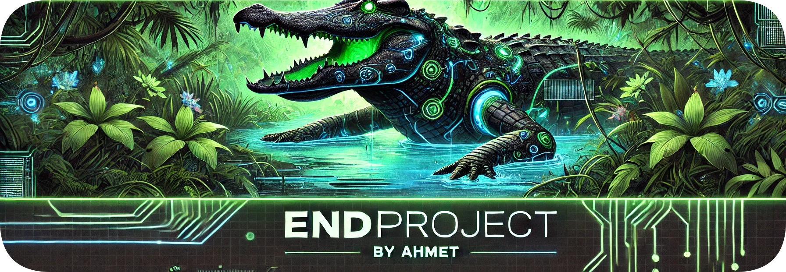
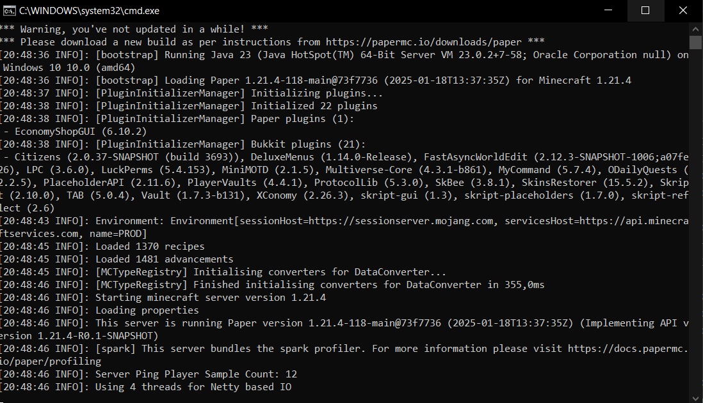

## Merhaba 👋

**AhmetAPI/AhmetAPI** depom, GitHub profilimde yer alan bu `README.md` dosyası sayesinde özel bir konuma sahip. Aşağıda projelerim, öğrenme süreçlerim, işbirliği alanlarım ve çeşitli görsel içeriklerle ilgili detaylar yer alıyor.

---

### 🚀 Projelerim & Çalışmalarım

- **Üzerinde Çalıştığım Projeler:**  
  Şu anda aktif olarak geliştirdiğim projeler hakkında bilgi alabilirsiniz.
  
  

- **Öğrenmekte Olduğum Alanlar:**  
  Şu anda aktif olarak "capture the flag"
  yarışmasına çalışıyorum  
  
---

### 📊 İstatistikler & Başarılar

- **GitHub İstatistiklerim:**  
  Profilimdeki aktifliği ve başarıları aşağıdaki görsellerle takip edebilirsiniz.
  
  
  
  

---

### 📸 Fotoğraf Galerisi

Burada, projelerimden ve katıldığım etkinliklerden bazı kareleri bulabilirsiniz:

- 
- 
- 

---

### 📫 İletişim & Sosyal Medya

- **E-posta:** [ahmet@sonproject.com.tr](mailto:[ahmet@sonproject.com.tr)
- **Instagram:** [@ahmet._.0765](https://www.instagram.com/ahmet._.0765/)
- **LinkedIn:** [Ahmet Malal](https://www.linkedin.com/in/ahmet-malal-019172352/) 
> **LinkedIn** Üzerinde aktif değilim
---

Bu örneği, kişisel ve projelerinize uygun şekilde düzenleyerek GitHub profilinize entegre edebilirsiniz. Görsel URL'lerini kendi dosyalarınız veya tercih ettiğiniz barındırma servisinden almayı unutmayın!

